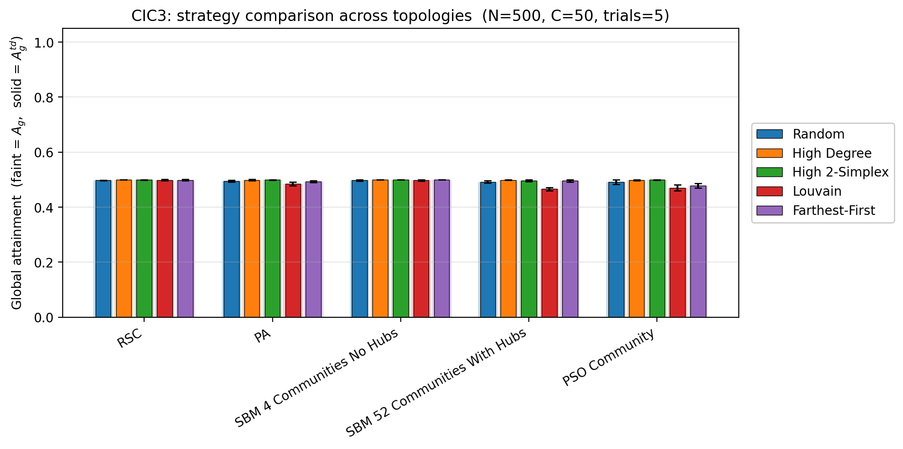
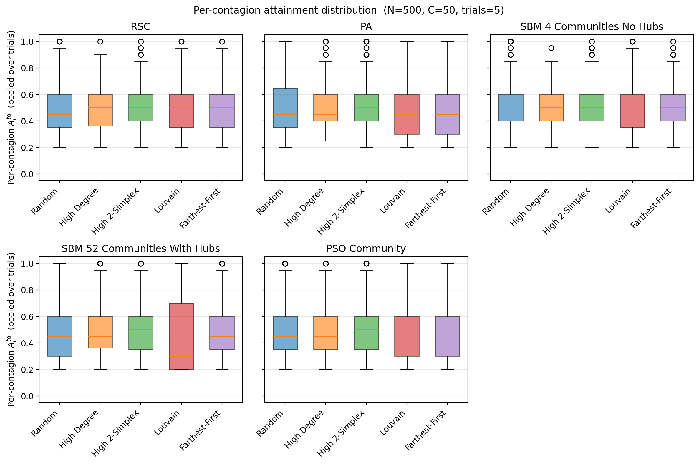
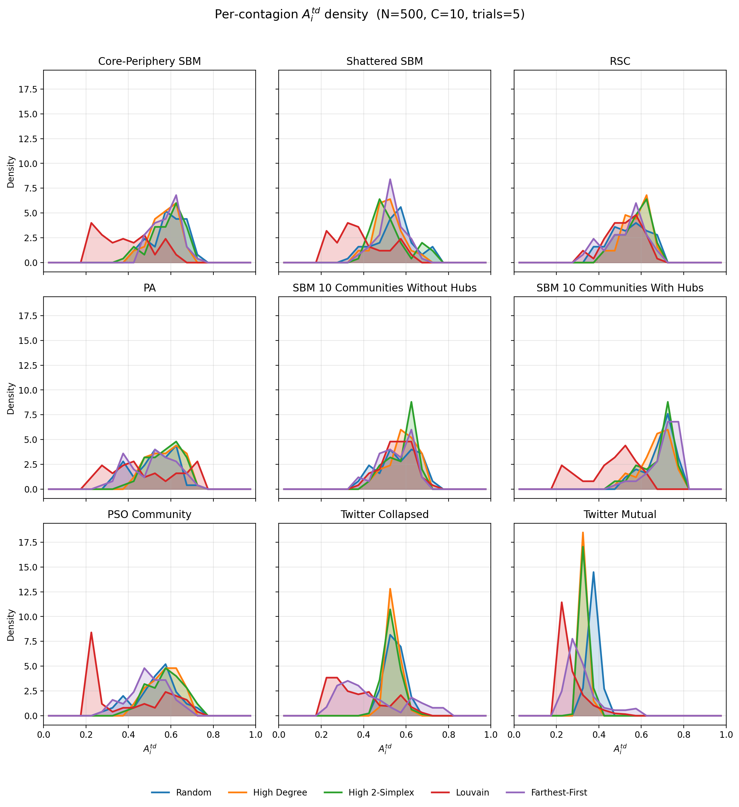

# Optimizing Seeding in Competitive Independent Capacity-Constrained Cascades

## Competitive Independent Capacity-Constrained Cascades (CIC3)

Many diffusion processes are only valuable up to a hard quota. For instance, social activities that leverage social contagion to recruit participants might only require a certain number of attendees before each subsequent attendee provides no value to the system or detracts value. A full social volleyball game only requires 12 people; adding more people to the game would detract from the net experience by causing some people to watch from the sidelines for periods of time. We refer to these types of contagions as **capacity-constrained cascades (C3s)**. Sometimes, many C3s are introduced simultaneously competing for attention with the goal of each one meeting its quota. We call this system **competitive independent capacity-constrained cascades (CIC3)**. Expanding on the previous example, if there were multiple social events occurring at the same time, then each event would be competing for attendees in the CIC3 process.

## Global CIC3 Evaluation - Deriving Time-Discounted Global Attainment

When evaluating CIC3 processes, we want to capture a few aspects of the system. The first is global attainment: we want to know how much of each contagion's quota was filled. The following definition matches this goal by only including infected nodes towards the numerator up to a given contagion's quota. 

Let $\mathcal{C}$ be the set of contagions.

Let $C_i \in \mathcal{C}$ denote contagion $i$. 

Let $I_i^{\text{raw}}$ be the set of nodes that were infected by $C_i$.

Let $t(v)$ denote the infection timestep of node $v \in I_i^{\text{raw}}$.

Let $Q_i$ be the quota for $C_i$. 

Define the capped infection count:

$$K_i = \min(|I_i^{\text{raw}}|, Q_i)$$

Then per-contagion attainment ($A_i$) and global attainment ($A_g$) are:

$$A_i = \frac{K_i}{Q_i} \in [0,1]$$

$$A_g = \frac{1}{|\mathcal{C}|} \sum_{C_i \in \mathcal{C}} A_i \in [0,1]$$

This formulation assumes that the values of each contagion meeting its quota are equal. If they were not equal, it would be trivial to redefine global attainment as a weighted average rather than the mean.

In most use cases, the speed of contagion would also be of interest. Infecting a node at an earlier timestep is more valuable than infecting a node at a later timestep. Assuming we have some value function $V(t)$ that maps an infection timestep to a value in $[0,1]$, we can reformulate our metric to include a time discount.

Let $t_{i,(1)} \le t_{i,(2)} \le \dots \le t_{i,(|I_i^{\text{raw}}|)}$ be the sorted infection times for nodes in $I_i^{\text{raw}}$. Define the time-discounted capped count as the sum of values for the earliest $\min(Q_i,|I_i^{\text{raw}}|)$ infections, truncated at $Q_i$:

$$K_i^{\text{td}} = \min \left( \sum_{k=1}^{\min(Q_i, |I_i^{\text{raw}}|)} V(t_{i,(k)}), Q_i \right)$$

Then:

$$A_i^{\text{td}} = \frac{K_i^{\text{td}}}{Q_i} \in [0,1]$$

$$A_g^{\text{td}} = \frac{1}{|\mathcal{C}|} \sum_{C_i \in \mathcal{C}} A_i^{\text{td}} \in [0,1]$$

## CIC3 Evaluation Metrics

To capture the dynamics of Competitive Independent Capacity-Constrained Cascades (CIC3), we define metrics across three dimensions: quota attainment, deadweight loss (over-exploitation), and topological penetration (exploration).

Let $\mathcal{C}$ be the set of contagions, where $C_i \in \mathcal{C}$ denotes contagion $i$. 
Let $I_i^{\text{raw}}$ be the set of nodes infected by $C_i$. 
Let $t(v)$ denote the infection timestep of node $v \in I_i^{\text{raw}}$. 
Let $Q_i$ be the hard quota for contagion $C_i$.

### 2. Deadweight Loss

**Intuition:** In a capacity-constrained system where nodes can only be infected by a single contagion, any node consumed by a contagion that has already met its quota represents wasted capacity. Deadweight loss quantifies this multi-order competitive interference, highlighting how dense local spreading starves competing contagions.

**Per-Contagion Deadweight Loss:**
$$D_i = \max(0, |I_i^{\text{raw}}| - Q_i)$$

**Global Deadweight Loss:**
$$D_g = \sum_{C_i \in \mathcal{C}} D_i$$

### 3. Mean Topological Penetration

**Intuition:** To differentiate between local trapping (exploitation) and network-wide spread (exploration), penetration measures the average structural distance a contagion travels from its origin. Lower values indicate the cascade was trapped in its local neighborhood, while higher values indicate successful navigation across bridges to distinct network regions.

Let $S_i$ be the set of initial seed nodes for contagion $C_i$, and $d_G(u, v)$ be the shortest path distance in the base graph $G$.

**Per-Contagion Mean Penetration Depth:**
$$P_i = \frac{1}{|I_i^{\text{raw}}|} \sum_{v \in I_i^{\text{raw}}} \min_{s \in S_i} d_G(s, v)$$

**Global Mean Penetration:**
$$P_g = \frac{1}{|\mathcal{C}|} \sum_{C_i \in \mathcal{C}} P_i$$

### 4. Analytical Proof: Inverse Relationship Between Infectivity and Penetration

**Intuition:** When a contagion's capacity ($Q_i$) is fixed, topological penetration becomes a zero-sum game of probability mass. If the contagion fails to secure enough nodes in its immediate neighborhood (depth 1), it is mathematically forced to explore further out (depth 2 and beyond). Therefore, lowering the edge infectivity directly forces an increase in penetration depth.

Consider a contagion $C_i$ starting at a single seed node $s \in S_i$ at depth $d=0$.
Let $k$ be the number of edges connecting $s$ to distinct nodes at depth $d=1$.
Let $\lambda \in [0, 1]$ be the simple edge infectivity (the probability of transmission across an edge in a single timestep).

Let $X_1$ be the random variable representing the number of successful infections at depth $d=1$ during the first timestep. Assuming independent edge transmissions, $X_1$ follows a Binomial distribution:

$$X_1 \sim \text{Binomial}(k, \lambda)$$

**The Fixed-Quota Depth Function**
To isolate the baseline penetration required to meet the quota, assume the contagion infects exactly $Q_i$ nodes (no deadweight). The sum of nodes infected at all depths $d$ must equal $Q_i$:

$$\sum_{d=1}^{d_{\max}} X_d = Q_i$$

Per our definition of mean topological penetration ($P_i$), the average depth of these $Q_i$ nodes is:

$$P_i = \frac{1}{Q_i} \sum_{d=1}^{d_{\max}} d \cdot X_d$$

We can isolate the depth $d=1$ infections ($X_1$) from the rest of the tree:

$$P_i = \frac{1}{Q_i} \left( 1 \cdot X_1 + \sum_{d=2}^{d_{\max}} d \cdot X_d \right)$$

Because $d \ge 2$ for all remaining terms, we can establish a strict lower bound for the penetration. The absolute minimum possible depth occurs if every single remaining node ($Q_i - X_1$) is infected exactly at depth $d=2$:

$$P_i \ge \frac{1}{Q_i} \Big( X_1 + 2(Q_i - X_1) \Big)$$

$$P_i \ge \frac{2Q_i - X_1}{Q_i} = 2 - \frac{X_1}{Q_i}$$

**The Probability Mass Shift**
To isolate the effect of $\lambda$, we take the expected value of the penetration depth. From the inequality above:

$$\mathbb{E}[P_i] \ge 2 - \frac{\mathbb{E}[X_1]}{Q_i}$$

Consider the scenario where the seed has exactly enough neighbors to satisfy the quota at depth 1 ($k = Q_i$). The expected number of nodes infected at depth 1 is simply the mean of the Binomial distribution ($\mathbb{E}[X_1] = \lambda Q_i$). Substituting this reveals the core relationship:

$$\mathbb{E}[P_i] \ge 2 - \frac{\lambda Q_i}{Q_i}$$

$$\mathbb{E}[P_i] \ge 2 - \lambda$$

Furthermore, the only way to achieve a perfect minimum penetration of $P_i = 1$ is if the contagion perfectly saturates its immediate neighbors ($X_1 = Q_i$). The probability of this occurring is:

$$P(P_i = 1) = P(X_1 = Q_i) = \binom{Q_i}{Q_i} \lambda^{Q_i} (1-\lambda)^0 = \lambda^{Q_i}$$

**Conclusion**
If $Q_i = 3$ and $\lambda = 1.0$:
$$P(P_i = 1) = 1.0^3 = 1.0$$
The contagion is 100% guaranteed to saturate at depth 1, resulting in minimum penetration.

If $Q_i = 3$ and $\lambda = 0.5$:
$$P(P_i = 1) = 0.5^3 = 0.125$$
There is an 87.5% chance that the contagion fails to fill its quota at depth 1 ($X_1 < 3$). Because the total nodes infected is fixed to $Q_i$, that missing probability mass is forced to propagate to deeper levels ($X_2, X_3 \dots X_n$), shifting the weighted average $P_i$ strictly higher. 

Taking the derivative with respect to $\lambda$:

$$\frac{\partial P(P_i = 1)}{\partial \lambda} = Q_i \lambda^{Q_i-1} > 0$$

Because the probability of shallow saturation strictly increases with $\lambda$, the expected penetration depth $\mathbb{E}[P_i]$ must strictly decrease as $\lambda$ increases.

## Comparison with Prior Metrics

Prior metrics for network contagion do not capture both a hard quota and a time-discounted value under that quota.

| Metric | What it measures | Why it is inadequate for CIC3 |
| :--- | :--- | :--- |
| **Final epidemic size / prevalence** | Total nodes ever infected | Monotone in infections. No hard quota $Q_i$ where value plateaus; counts infections beyond $Q_i$ as benefit. No time weighting. |
| **Basic reproduction number $R_0$** | Expected secondary infections per primary | No notion of a quota. No time-value function $V(t)$. |
| **Expected spread $\sigma(S)$** | Expected activated nodes from seed set $S$ | Objective increases with every additional adoption past $Q_i$; does not enforce $\min(|I_i^{\text{raw}}|, Q_i)$. |
| **Structural virality** | Average distance in diffusion tree | Describes shape of spread, not whether $Q_i$ was met or how early infections occurred. |
| **Time to $k$ infections** | Speed to reach a fixed count $k$ | Measures latency but does not cap value at $Q_i$ and does not apply a graded $V(t)$ to all infections within the quota. |

## Experiments

### CIC3 Seeding Strategy Comparison

The `experiments/cic3_seeding_strategies.ipynb` notebook compares five seeding strategies across four network topologies under the CIC3 evaluation metric. Each (topology, strategy) cell runs `NUM_TRIALS` independent simulations and aggregates the results.

**Strategies.** Three baselines plus two new clustering-based strategies:

- **Random** — uniformly sampled disjoint seed sets per contagion.
- **High Degree** — top-degree nodes assigned round-robin across contagions.
- **High 2-Simplex** — top-triangle-participation nodes assigned round-robin across contagions.
- **Louvain** — runs a single-level Louvain community detection pass on the edge list, ranks communities by internal edge-endpoint density, and fills each of the top $C$ communities with the highest-internal-degree nodes in that community. Falls back to Farthest-First if Louvain finds fewer than $C$ communities.
- **Farthest-First** — picks $C$ BFS-farthest centers (explicitly avoiding high-degree hub nodes as centers) and grows a BFS-ball of `num_seeds_per_contagion` around each center, preferring low-degree community members within each BFS layer so hubs are not pulled in.

Both clustering-based strategies discover community structure directly from the graph with no external labels — they use the same `(N, num_seeds_per_contagion, links, triangles)` constructor as the baselines.

**Topologies.** `RSC` (random simplicial complex, Erdős–Rényi-style), `BA` (Barabási–Albert with a simplicial extension), `SBM` (a small stochastic block model), and `SBM-Manual` — an SBM configured to stress clustering-based strategies:

- $N = 500$, $K = 53$ communities with sizes `[9]*52 + [32]`.
- 52 small communities are full cliques (`p_intra = 1.0`), with very low cross-community bleed (`p_inter = 0.003`).
- One hub community (size 32) connects densely to every other community (`p_inter = 0.15`) and has moderate internal density (`p_intra = 0.5`). Hub nodes dominate the degree distribution.
- Triangle probabilities: `[0.2]*52 + [0.04]`. Realized $\langle k \rangle \approx 19.05$, $\langle k_\Delta \rangle \approx 6.54$.

**Metric.** Global attainment $A_g$ and time-discounted global attainment $A_g^{\text{td}}$ with $V(t) = e^{-0.05 t}$. Quotas are set so $\sum_i Q_i = N$ (no slack), with $C = 50$ contagions and $Q_i = N/C = 10$.

### Charts

**`figures/cic3_strategy_comparison.png`** — Grouped bar chart comparing the five strategies across the four topologies. Solid bars show mean $A_g^{\text{td}}$ across trials; faint bars behind show mean $A_g$. Error bars are trial-to-trial standard deviation.

**`figures/cic3_per_contagion_distribution.png`** — Per-topology boxplots of the pooled per-contagion $A_i^{\text{td}}$ values across all trials and contagions. One boxplot group per topology, with one box per strategy showing the median, IQR, whiskers, and outliers of individual contagion attainments.

**`figures/cic3_per_contagion_pdf.png`** — Per-topology overlapping probability density curves of per-contagion $A_i^{\text{td}}$ built from `np.histogram(density=True)` (one curve per strategy per topology). Designed to surface shape features that boxplots flatten — bimodality, long lower tails, and saturation spikes at $A_i^{\text{td}} = 1$.

## Notes

### Deadweight and Penetration

Two additional CIC3 metrics complement attainment:

- **Deadweight** D_i = max(0, |I_i^raw| - Q_i): nodes infected by C_i beyond its quota. These wasted infections represent contagion that overshot the capacity constraint. Global deadweight D_g = mean(D_i). Deadweight is only meaningful when the simulation runs past quota fulfillment (see termination below).

- **Penetration** P_i: mean BFS hop distance from C_i's seed nodes to all nodes infected by C_i, computed over the induced subgraph of C_i-infected nodes. Nodes unreachable from any seed in the induced subgraph are excluded. Global penetration P_g = mean(P_i). Measures how deeply each contagion diffused into the network.

### Simulation Termination

By default (`stop_on_all_quotas_met=False`), the simulation runs until no susceptibles remain or `t_max`. Contagions continue spreading after meeting their quota, which makes deadweight a meaningful metric. Set `stop_on_all_quotas_met=True` for the legacy behavior (stop when all quotas are met).

The high-degree seeding strategies tended to perform the best, except for over one topology: the twitter mutual network. Over that network, random seeindg performed the best. The community based seeding and furthest distance-based strategy did not work that well on any topology. These results were very odd, especially the random performing the best on the twitter mutual network. I statistically showed that the performance of random was statistically significantly better than the other strategies. Then, I examined various distributions in the graph topologies to try to find what made the twitter mutual network special. The primary difference between the twitter mutual network and the other topologies was that it was a lot sparser. It may be that degree-centrality seeding is the optimal strategy when the network is too dense for community structure to adequately contain contagion.

Experiment idea. Maybe we take the SBM and define some variables to tweak:
- Inter Community Connection: varying from isolated communities that only connect to hubs to no community structure at all.
- Intra Community Connection: varying from fully connected communities to sparsely connected communities
- Hubbyness: Fix this. We're investigating community structure and sparseness, not degree distribution
With this, make a heatmap with inter community conenction on the y axis and intra on the x axist and the performance of our selected seedin strategies as the heat value. Do this for each seeding strategy. Could also fix one or the other, sweer the non-fixed one, and plot all the seeding strategy's performance values on the same plot.

Update: The experiments did not show the expected pattern with random beating our high degree. Maybe we need to test a topology with a power law degree distribution and community structure?

Update: We tried the tests on a popularity-similarity topology with community structure and we were still unable to replicate the anomoly noticed on the twitter mutual network.

Update: We tried doing it on a network with super super sparse connections between communities and it worked finally, showing random to work better. The explination is obvious: using high-degree seeding makes certain parts of the network unreachable because they're disconnected or maybe blocked by a different contagion over a bridge.

## Presentation
1. Intro Slide
2. Replication Recap - Simplex Definition
3. Replication Recap - Results

4. Problem Statement - Competing Contagions with limit, Sidequest Activities
5. Roadmap
6. Attainment Formulation
7. Dead Weight and Penetration Formulation

8. Find relationships between infectivity and attainment, dead weight, and penetration. Craft narrative that explains those relationships
9. Sweeping Infectivity vs Attainment Graphs - positive correlation with lambda, negative/flat with lambda delta
a. top left: aggregated RSC lambda sweeps. top right: aggregated BA and SBM lambda sweeps. bottom: conclusion
b. top left: aggregated RSC lambda delta sweeps. top right: aggregated BA and SBM lambda delta sweeps. bottom: conclusion
10. Dead Weight - drives performance, generally less deadweight as we get more infective, mostly driven by lambda delta
- top left D_g v A_g^td scatterplot. top right RSC deadweight/lam/lam_d heatmap. bottom is deadweight definition and conclusion
11. Penetration - Greater infectivity means less penetration/exploration of each contagion
11a. top left P_g v A_g^td scatterplot. top right RSC penetration/lam/lam_d heatmap. bottom is penetration definition and conclusion
11b. Math showing how the variance in hop distance is more at lower infectivities
12. Conclusions - Exploration is good for business

13. Find relationships between topology and attainment, dead weight, and penetration.
14. Community Structure - 
- Community Isolation Sweeps (Use the SBM with 10 equal communities and vary the probability of intra-community connections. Do this for 3 values of the probabiity for intercommunity connection. In each simulation, measure the attainment, time discounted attainment, deadweight, and penetration. For each metric, make 2 graphs: one with each metric from the 3 different values of intercommunity probability each plotted as its own line and 1 where they are averaged. For attainment, make the graph have time discounted attainment and regular attainment as a line with less weight and shade between them like we do in cic3_attainment_sweep.ipynb.)
15. Hub Prevalence
- Hub Prevalence Sweeps (Now, lets test the correlation between hubbyness and our metrics. Make a new notebook for this. I want to use the BA generator for this. Make some wrapper for that class so we can vary between a power law degree distribution prevalence and random. The wrapper should use BA to make an initial graph. Then, given some parameter determining the proportion of edges to rewire, samples edges without replacement, detaches those edges from the nodes they are one, and connects 2 random nodes with it. Then, make a notebook that simulates these networks by sweeping the proportion of rewired edges from 0 to 1. Do this for 3 values of lambda. In each simulation, measure the attainment, time discounted attainment, deadweight, and penetration. For each metric, make 2 graphs: one with each metric from the 3 different values of lambda each plotted as its own line and 1 where they are averaged. For attainment, make the graph have time discounted attainment and regular attainment as a line with less weight and shade between them like we do in cic3_attainment_sweep.ipynb.)
16. Conclusions - Community struture helps exploitation, power law degree distribution helps exploration

17. What are the best seeding strategies to use in which situations?
- Top: Attainment By Seeding X Topology for RSC, PA, SBC Communities, PSO Communities. Bottom: Winner Matrix of Hub Prevalence X Community Structure
18. Real World Data Test - Why is random working here? It's not in our matrix anywhere?
- Seeding By Twitter Collapsed and Mutual
19. Hypothesis: Sparseness + Community Structure + Core-Periphery "Rich Club" Structure
- SBM Block Matrix
20. 
- P_CP v P_PI heatmaps & barcharts
21. Conclusions
- Update winners matrix with the new regime: hub prevalence, community prevalence, sparse bridges
