# Optimizing Seeding in Competitive Independent Capacity-Constrained Cascades

## 0. Abstract

This paper introduces the Competitive Independent Capacity-Constrained Cascade (CIC3) model for studying social contagion in networks with higher-order interactions. Building upon the Simplicial Contagion Model (SCM), we extend the framework to capture scenarios where multiple diffusion processes compete simultaneously for a finite pool of participants, each with a hard quota. We define novel evaluation metrics including time-discounted global attainment, deadweight loss, and penetration depth to characterize CIC3 dynamics. Through extensive simulations on synthetic and empirical networks, we investigate how network topology and seeding strategies affect system performance. Our findings reveal that: (1) increasing pairwise infectivity substantially improves attainment while higher-order infectivity has minimal effect, (2) power-law degree distributions negatively impact CIC3 performance due to first-mover advantages at hubs, and (3) high-degree seeding generally outperforms community-based strategies except in networks with strong community structure and no hubs. These results provide practical guidance for optimizing seed placement in competitive diffusion scenarios such as event promotion and viral marketing campaigns.

## 1. Introduction
Contagion refers to the process by which a pathogen such as a virus, information, or an opinion spreads across a network. Traditional models of contagion rely on graphs where interactions are strictly dyadic, meaning that the contagion is modeled to traverse along the simple edges of the network. This approach is inadequate in the context of social contagion, where contagion through group interactions behaves fundamentally differently from contagion through pairwise interactions. For example, someone adopting a norm because other people independently convinced them to can not be equated to them adopting a norm because everyone in a participating group is an adopter. This is the difference between simple contagion and complex contagion.

To model this difference between pairwise interactions and group interactions, Iacopini et al. [1] formalize different interactions as simplices. Recalling the definition of a simplex, a $k$-simplex $\sigma$ is a set of $k+1$ vertices. A 0-simplex would be just a single node. A 1-simplex would be a pair of nodes with an edge connecting them. A 2-simplex or higher would be the set of $k+1$ nodes with a hyperedge connecting them in a group interaction.

With this definition of group interactions as simplices, Iacopini et al. [1] proposed the simplicial contagion model (SCM) as a modeling framework for contagion in social contexts, unifying simple and complex contagion into a single coherent modeling framework. The SCM treats different $k$-simplex interactions as containing fundamentally different processes by describing contagion as a stochastic process where the infection rates depend on the dimensionality of the interaction. In simpler terms, the infection rate of a 1-simplex ($\beta$) and that of a 2-simplex ($\beta_{\Delta}$) are independent of each other. When modeled this way, group influence cannot be decomposed into independent pairwise edges.

Iacopini et al. [1] tested the SCM on several empirical and synthetic networks, yielding two primary conclusions: (i) higher-order interactions change the epidemic threshold transition from continuous to discontinuous and (ii) a bistable region emerges where both healthy and endemic states co-exist depending on the initial infection density. The SCM featuring a first-order phase transition explains well the "critical mass" observed to be required to trigger large-scale social change.

While the SCM assumes the contagion is unbounded contagion, many social diffusion processes are only valuable up to a hard quota. For instance, social activities that leverage social contagion to recruit participants might only require a certain number of attendees before each subsequent attendee provides no value to the system or detracts value. A full social volleyball game only requires 12 people; adding more people to the game would detract from the net experience by causing some people to watch from the sidelines for periods of time. We refer to these types of contagions as capacity-constrained cascades (C3s).

Furthermore, the SCM assumes that only a single contagion exists in the system, but many real-world systems contain competing diffusion processes. Sometimes, many C3s are introduced simultaneously competing for attention with the goal of each one meeting its quota. We call this system competitive independent capacity-constrained cascades (CIC3). Expanding on the previous example, if there were multiple social events occurring at the same time, then each event would be competing for attendees in the CIC3 process.

We define the CIC3 process and empirically characterize the effects of topology and infection seeding on the CIC3 process over simplicial complexes.

## 2. Prior Works
To perform their experiments, Iacopini et al. [1] generated random simplicial complexes (RSC) on a scale ranging from low rescaled infectivity to high rescaled infectivity, calculated as a function of the pairwise infection rate $\beta$, the recovery rate $\mu$, and the average node degree $\langle k \rangle$ according to the formula: 
$$\lambda=\frac{\beta\langle k\rangle}{\mu}$$
where $\lambda$ represents the base rescaled infectivity. This rescaled infectivity score represents the potency of the contagion, meaning that a higher rescaled infectivity should correlate with a higher final infection density. They simulated the SCM over these synthetic networks at varying levels of 2-simplex rescaled infectivity rates ($\lambda_{\Delta}$). The results from these simulations display the discontinuous phase transition.

Given the use of RSCs, they characterized the discontinuous phase transition using the mean field approach, which provided a theoretical convergence node density based on the assumption of homogeneous mixing to check their simulations against. This yielded the following analytical solution for final node density:

$$\rho^{*}=\frac{(\lambda_{\Delta}-\lambda)+\sqrt{(\lambda-\lambda_{\Delta})^{2}-4\lambda_{\Delta}(1-\lambda)}}{2\lambda_{\Delta}}$$

where $\lambda_{\Delta}=\frac{\beta_{\Delta}\langle k_{\Delta}\rangle}{\mu}$ is the 2-simplex rescaled infectivity. This analytical solution correctly captures the phase transition since the discriminant is negative, the non-zero roots become complex, meaning that the endemic stationary state ceases to exist in the real domain, leaving only the absorbing state at zero.

Figure 1 plots these simulations for varying values of rescaled infectivity and $\lambda_{\Delta}$, showing a discontinuous phase transition for each set of simulations using a non-zero $\lambda_{\Delta}$. But, when $\lambda_{\Delta}$ is zero, meaning that the model is reduced to a simple contagion model without higher order interactions, the visualization displays a second order continuous phase transition.

Figure 2 plots simulations for varying initial densities of infected nodes over time with $\lambda$ fixed at 0.75 and $\lambda_{\Delta}$ fixed at 2.5. For this configuration, the theoretical initial node density threshold is:

$$\rho_{c}=\frac{(\lambda_{\Delta}-\lambda)-\sqrt{(\lambda-\lambda_{\Delta})^{2}-4\lambda_{\Delta}(1-\lambda)}}{2\lambda_{\Delta}}$$

plotted as a dashed line. These temporal evolutions of the infection density show the simulations starting above the threshold converging to the theoretical final infection density while the simulations with an initial infection density below the threshold converge to an infection density of zero. This shows the bistable region where the infection density is either zero or converges into a state where both infected and healthy nodes coexist.

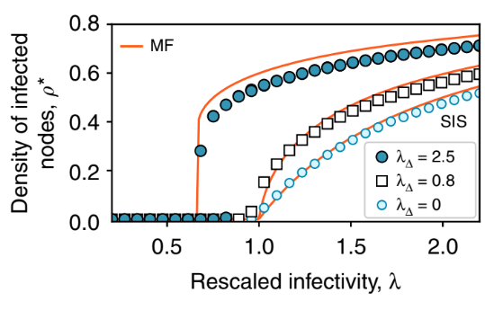

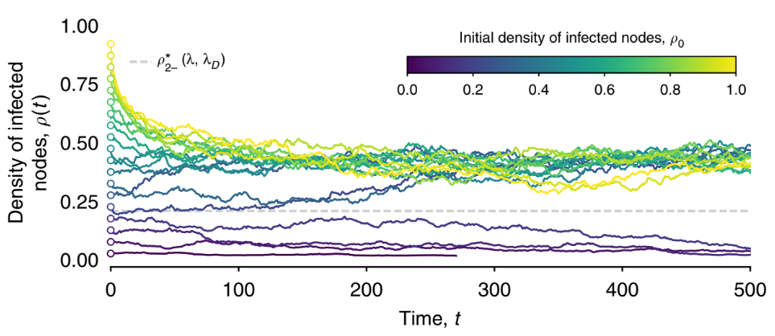

## 3. Validating Our SCM
We aim to replicate their conclusion regarding the SCM yielding a discontinuous phase transition and the emergence of the bistable region dependent on initial node density. In order to perform this replication, we aim to recreate their simulations over synthetic 2-simplex networks, recreating figures 1 and 2.

To recreate figure 1, we must simulate the SCM for varying rescaled infectivities and values of $\lambda_{\Delta}$. Our simulation results must feature a discontinuous phase transition that approximately coincides with the mean field approach analytical solution as described in Equation 1. Including the mean field approach solution validates the implementation of our random graph generation and simulation mechanics. Ensuring that our simulation results approximately match, not only the results in Iacopini et al. [1], but also the theoretical results as calculated by the mean field approach verifies that our models are not globally biased in either direction.

To recreate figure 2, we must simulate the SCM over varying values of initial node density with a fixed rescaled infectivity, track the infection density over time, and observe the expected hysteresis loop and bistability. The results of these simulations must produce a bistable region, with simulations starting above the theoretical threshold as calculated by the mean field approach converging to the predicted final infection density and simulations below that threshold converging to zero. In these simulations, we expect the threshold to be sensitive to stochastic noise in the SCM relative to the size of the random network. This is because, on small networks, random chance may push the infection density of simulations starting near the threshold above the threshold. On larger networks, the noise will be less impactful to the overall network density, and thus the results will be less sensitive to noise.

The replication successfully reproduced the discontinuous phase transition and bistability inherent to the SCM. Intuitively, this discontinuity arises because 2-simplices require multiple active neighbors to transmit the contagion, creating a synergistic effect that only sustains itself once a critical mass (the threshold density) is reached. Furthermore, because these simulations utilized RSCs—which possess a binomial degree distribution and lack dense community clustering—the structural distinction between random and deliberate initial seeding is minimal, allowing the homogeneous mixing assumption of the mean-field approach to hold accurately.

Our simulations, using the same simulation and graph construction hyperparameters as the original paper, are shown in figures 3 and 4. Figure 3 shows the discontinuous phase transition for each SCM simulation, and each simulation approximately matches the mean field approach analytical solution. Figure 4 shows the bistable region dependent on initial node density, with simulations starting above the density threshold converging to an endemic state and simulations starting below the density threshold converging to a healthy state.

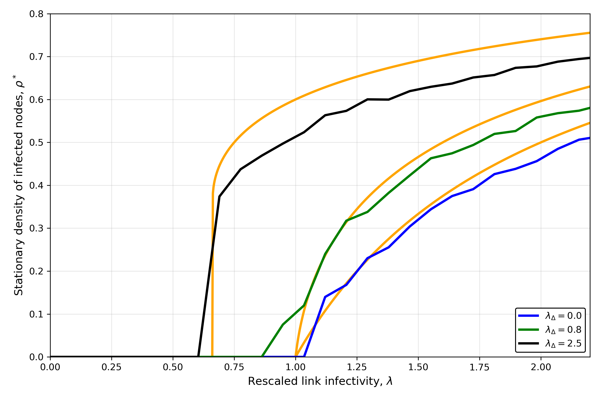

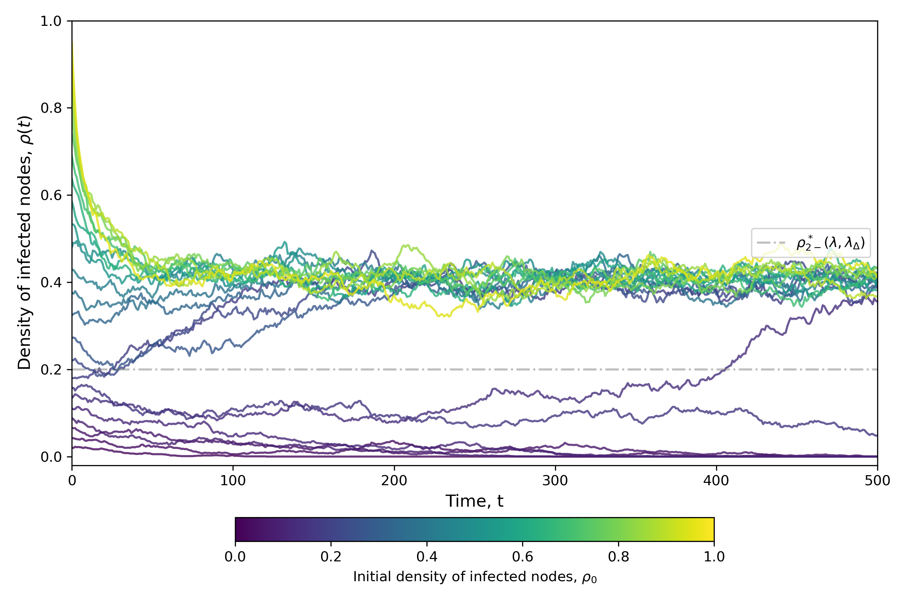

Notably, two simulations with an initial node densities below the threshold, converged to the endemic state. One explanation is that this exception was due to random noise since the network was small (2,000 nodes). Another explanation is that the theoretical threshold is too high since its derivation assumed homogeneous mixing. To test these explanations, after verifying that all network statistics matched that of the original paper, we reran the simulation over larger random networks with 8,000 nodes. If the anomaly was due to random chance, then the scale would reduce the impact of noise and the results would adhere to the theoretical threshold. The results of these simulations, shown in figure 5, did not coincide with the theoretical results. Thus, we concluded that the real threshold for our random graphs was lower than the theoretical threshold derived via the mean field approach.

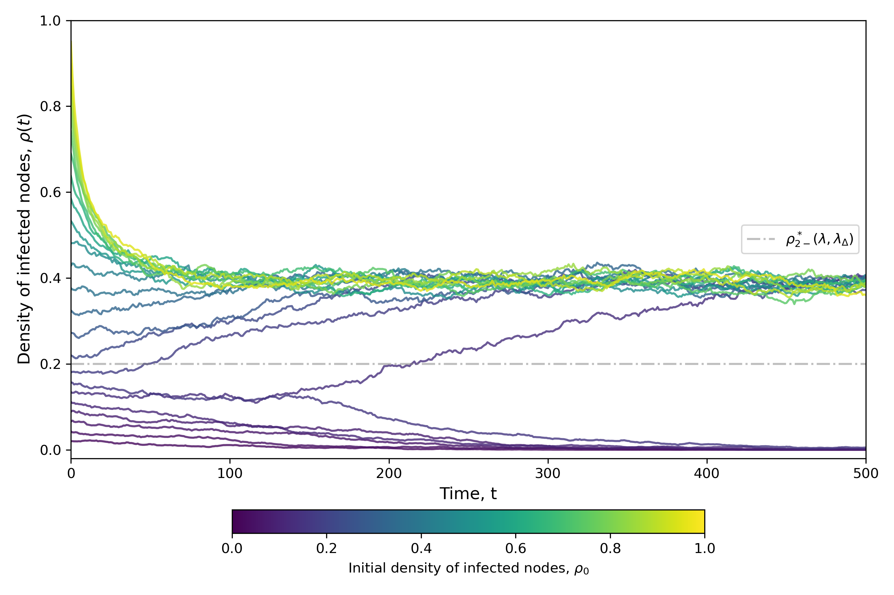

## 4. Competitive Independent Capacity-Constrained Cascade (CIC3) Model
We now introduce the Competitive Independent Capacity-Constrained Cascade (CIC3) model for social contagion. We first define the conditions where CIC3 systems emerge. Then, we define and provide intuition for the primary metric to understand the results of a CIC3 diffusion process. Lastly, we define and provide intuition for secondary metrics that help when analyzing CIC3 diffusion processes.

### 4.1 CIC3 Formulation
CIC3 diffusion processes are driven by the presence of a special type of diffusion process. Let $\mathcal{C}$ be the set of contagions and $C_i \in \mathcal{C}$ denote contagion $i$. Each contagion spreads across the network via diffusion process, accumulating infected nodes. Let $I_i^{\text{raw}}$ be the set of nodes that were infected by $C_i$. Each contagion receives value from infected nodes only up to a quota. Any node infected past this quota provides no value to the system. Let $Q_i$ be the quota for $C_i$.

### 4.2 Primary Metric - Time-Discounted Attainment
When evaluating CIC3 processes, we are primarily interested in the net value accrued to the system. A couple assumptions will drive our mathematical definition of value:
1. Each contagion is equally important (meaning that reaching each contagion's quota contributes equally to the net value no matter the size of the contagion).
2. The number of nodes already infected with contagion $i$ does not affect the value provided by infecting another node prior to exceeding the quota.

To get to a net value function, we first define value local to a specific contagion $i$ as the proportion of the capped count of nodes infected up to the quota to the quota. We call this metric attainment:

$$K_i=\min(|I_i^{\text{raw}}|,Q_i)$$
$$A_i=\frac{K_i}{Q_i}\in[0,1]$$

To create a fair comparison across different graph sizes and contagion statistics, we average across $A_i$ to calculate the global attainment:

$$A_g=\frac{1}{|\mathcal{C}|}\sum_{C_i\in\mathcal{C}}A_i\in[0,1]$$

In most use cases, the speed of contagion is also of interest. Infecting a node at an earlier timestep is more valuable than infecting a node at a later timestep. Assuming we have some value function $V(t)$ that maps an infection timestep to a value in $[0,1]$, we can reformulate single-contagion attainment into a time-discounted single-contagion attainment.

Let $t_{i,(1)}\le t_{i,(2)}\le\dots\le t_{i,(|I_i^{\text{raw}}|)}$ be the sorted infection times for nodes in $I_i^{\text{raw}}$. Define the time-discounted capped count as the sum of values for the earliest $\min(Q_i,|I_i^{\text{raw}}|)$ infections, truncated at $Q_i$:

$$K_i^{\text{td}}=\min\left(\sum_{k=1}^{\min(Q_i,|I_i^{\text{raw}}|)}V(t_{i,(k)}),Q_i\right)$$

Time-discounted single-contagion attainment is then calculated using the time-discounted capped count:

$$A_i^{\text{td}}=\frac{K_i^{\text{td}}}{Q_i}\in[0,1]$$

And, time-discounted global attainment is calculated as the mean of time-discounted single-contagion attainment:

$$A_g^{\text{td}}=\frac{1}{|\mathcal{C}|}\sum_{C_i\in\mathcal{C}}A_i^{\text{td}}\in[0,1]$$

Our analysis focuses on the dynamics of CIC3 where the above assumptions are held and our conclusions are limited to such scenarios. Relaxing the assumptions would trivially change the value function to be conditioned on the contagion and infected node infection rank.

### 4.3 Secondary Metric - Deadweight Loss
In a capacity-constrained system where nodes can only be infected by a single contagion, any node consumed by a contagion that has already met its quota represents wasted capacity. Deadweight loss quantifies this multi-order competitive interference, highlighting how dense local spreading starves competing contagions. We define single-contagion deadweight simply as the number of nodes infected beyond that contagion's quota:

$$D_i=\max(0,|I_i^{\text{raw}}|-Q_i)$$

Global deadweight then becomes the sum of single-contagion deadweight:

$$D_g=\sum_{C_i\in\mathcal{C}}D_i$$

### 4.4 Secondary Metric - Penetration
To differentiate between local trapping (exploitation) and network-wide spread (exploration), penetration measures the average structural distance a contagion travels from its origin. Lower values indicate the cascade was trapped in its local neighborhood, while higher values indicate successful navigation across bridges to distinct network regions. Let $S_i$ be the set of initial seed nodes for contagion $C_i$, and $d_G(u,v)$ be the shortest path distance in the base graph $G$. The single-contagion mean penetration depth then becomes:

$$P_i=\frac{1}{|I_i^{\text{raw}}|}\sum_{v\in I_i^{\text{raw}}}\min_{s\in S_i}d_G(s,v)$$

The global penetration becomes the average penetration across each contagion:

$$P_g=\frac{1}{|\mathcal{C}|}\sum_{C_i\in\mathcal{C}}P_i$$

## 5. Results
We present our empirical findings on CIC3 dynamics across three dimensions: the effects of infectivity parameters on attainment and secondary metrics, the influence of network topology on system performance, and the impact of seeding strategies across different network structures. Our experiments cover three synthetic topologies: Random Simplicial Complexes (RSC), Stochastic Block Models (SBM) with community structure, and Barabasi-Albert (BA) preferential attachment networks with power-law degree distributions.

### 5.1 Understanding CIC3 in Complex Contagion
Here we examine the effects of $\lambda$ and $\lambda_{\Delta}$ on global attainment, deadweight, and penetration, in addition to exploring the effects of deadweight and penetration on attainment. Figure 6 shows the relationship between deadweight and attainment across network topologies. Each topology shows a clear and statistically significant negative correlation between deadweight and attainment. This is expected since deadweight directly counteracts the system's ability to distribute nodes to contagions. Also of note, the BA networks have a somewhat less negative correlation than the other two while having a lower overall attainment and higher overall deadweight. The most intuitive explanation is that, whichever contagion gets to the hub first, that contagion immediately infects beyond its quota, driving up deadweight, while the other network topologies place each contagion on more equal footing. The effect of hubs will be explored in a later section.

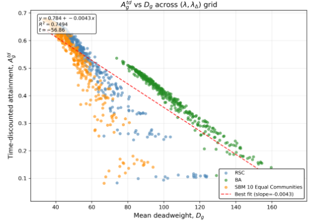

Figure 7 shows the effect of penetration on attainment. Overall, penetration has a high correlation with attainment, but most of the correlation comes from the power-law distributed BA network. The other topologies seem minorly correlated. One explanation is that high penetration means high exploration. Exploration might just matter more in power-law distributed networks where infecting a single node might trap a contagion in a small part of the network.

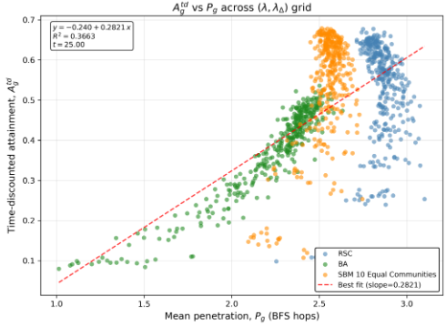

Figures 8a and 8b show the correlation of $\lambda$ with attainment and the correlation of $\lambda_{\Delta}$ with attainment. Increasing $\lambda$ increases attainment substantially, but increasing $\lambda_{\Delta}$ does not affect the system.

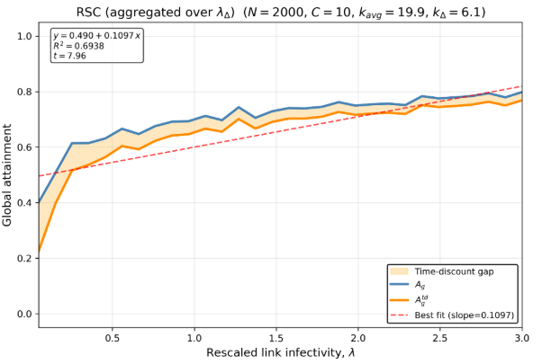

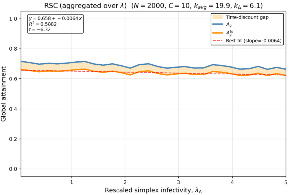

Figures 9a and 9b explain this behavior. Figure 9a is a heatmap showing the values of deadweight at different values of $\lambda$ (x axis) and $\lambda_{\Delta}$ (y axis). Those figures show that $\lambda$ correlates with lower deadweight and higher penetration while $\lambda_{\Delta}$ does not affect those metrics.

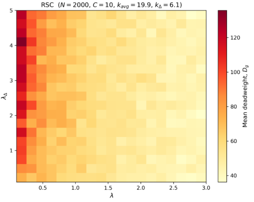

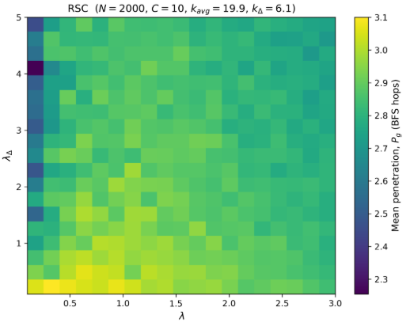

From these experiments, we see that increasing $\lambda$ leads to higher attainment driven by lower deadweight and higher penetration. Lower deadweight and higher penetration both correlate with higher attainment. We also saw that complex infectivity ($\lambda_{\Delta}$) does not affect the system notably.

### 5.2 Understanding the Effects of Topology on CIC3
The first hypothesis to test was that community structure would affect CIC3 substantially, enabling it to achieve higher attainment by enabling each contagion to spread in isolated communities largely unhindered by other contagions. To test this hypothesis, we devised an experiment meant to measure the effect of community structure. The idea of the experiment is to vary between heavy community structure and a random graph by varying the difference between the off-diagonal block probabilities ($p_{\text{inter}}$) and the diagonal probability ($p_{\text{intra}}$) of the SBM.

When $p_{\text{inter}}\ll p_{\text{intra}}$, the system features isolated and tightly knit communities. When $p_{\text{inter}}=p_{\text{intra}}$, the network collapses to a random network. While $p_{\text{inter}}$ is swept from 0 to $p_{\text{mid}}$, $p_{\text{intra}}$ is swept from 1 to $p_{\text{mid}}$ to preserve the average degree of the system. A diagram of the experimental setup is shown in Appendix A. The results are plotted against attainment, deadweight, and penetration. These results are shown in Figure 10.

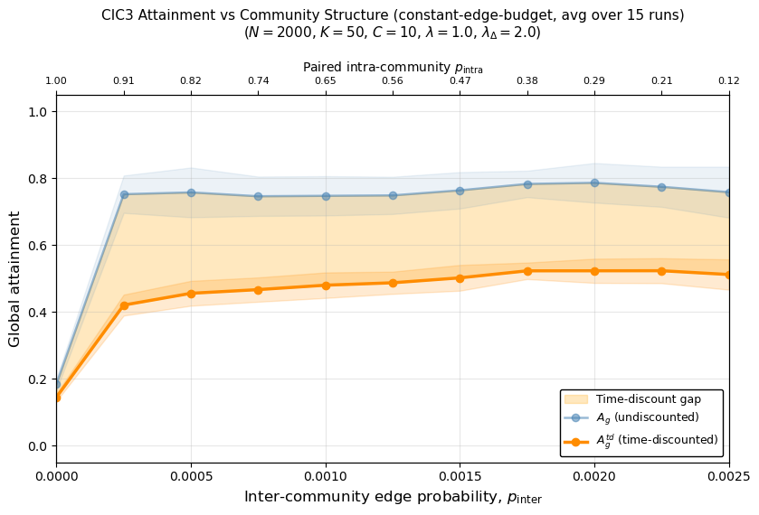

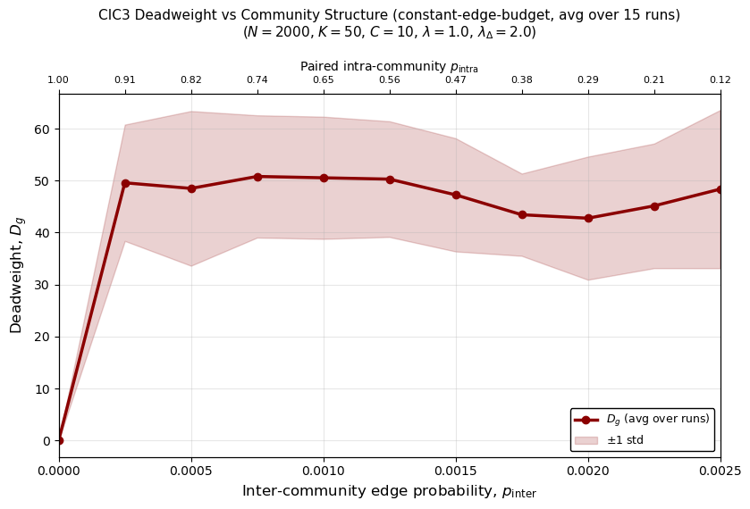

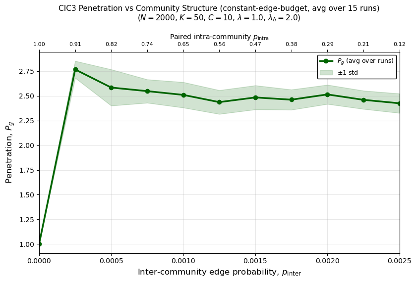

Attainment, deadweight, and penetration seem to all not be affected by community structure in the way we have defined it in this experiment. The anomaly at $p_{\text{inter}}=0$ is due to communities being entirely disconnected and not containing a seed node, which is a trivial result. The rest of each plot shows no clear connection between community structure and our key metrics.

The next topological feature we are interested in is the prevalence of hubs and a power law degree distribution. We hypothesized in the previous section that the first mover advantage that a power law degree distribution enables applies to contagions in CIC3 in addition to the introduction of the nodes themselves. Whichever node reaches a hub first will immediately infect beyond its quota, increasing deadweight. To test this hypothesis, we formulate an experiment that varies a network between a power law and a poisson degree distribution by progressively adding noise to the topology. 

We first build a preferential attachment network via the algorithm established by Barabasi and Albert [2]. Then, we randomly sample a proportion of edges $p_{\text{rp}}$ and delete them. We then add the same number of edges back into the network connecting them to random nodes. At $p_{\text{rp}}=0$, the network is completely generated by the BA procedure, featuring a power law degree distribution. At $p_{\text{rp}}=0.5$, half of the network is noise while the other half adheres to the power law degree distribution. At $p_{\text{rp}}=1$, the network is a random graph. We then analyze the correlations between the edge rewiring fraction and attainment, deadweight, and penetration. The experimental design is further explained in Appendix A. The results are shown in Figure 11.

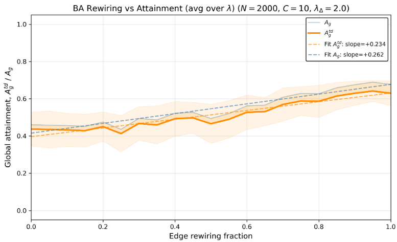

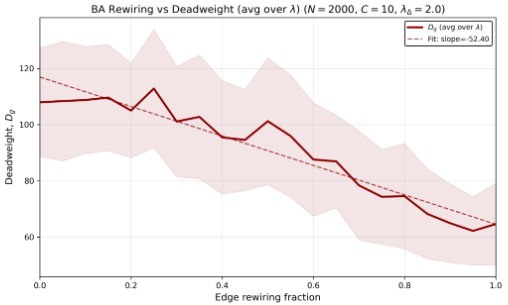

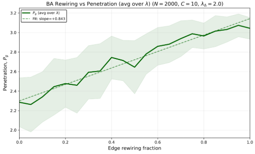

The introduction of noise significantly benefits the system by increasing attainment, decreasing deadweight, and increasing penetration. While this does not prove the first mover advantage hypothesis, it does prove that a power law degree distribution negatively affects CIC3 systems.

### 5.3 Understanding the Effects of Seeding on CIC3
We now seek to understand the effects of the placement of the initial infected seed nodes across topologies in CIC3. We formalize three seeding strategies: random seeding, high degree seeding, and farthest-first seeding. The random seeding strategy randomly samples the next node to seed from a uniform distribution. The high degree seeding strategy selects the node with the highest degree who isn't already infected. The farthest first strategy maximizes the distance between the selected node, the largest hub, and any other seeds to provide the contagions with maximum separation to spread unimpeded by others.

We test each seeding strategy across a matrix of topologies featuring each combination of community structure and hub prevalence. The RSC has neither community structure nor hubs. The SBM with 10 communities has community structure but no hubs. The BA network has hubs but no community structure. And lastly, we modified the popularity-similarity optimization network described by Papadopoulos et al. [3] by discretizing the possible angles to sample from and adding minimal noise to create a network with both community structure and a power law degree distribution. Lastly, we test the Twitter Mutual follows network from the Stanford Large Network Dataset Collection [4]. The results of the tests are shown in Figure 12. Distributions of the generated networks are in Appendix A.

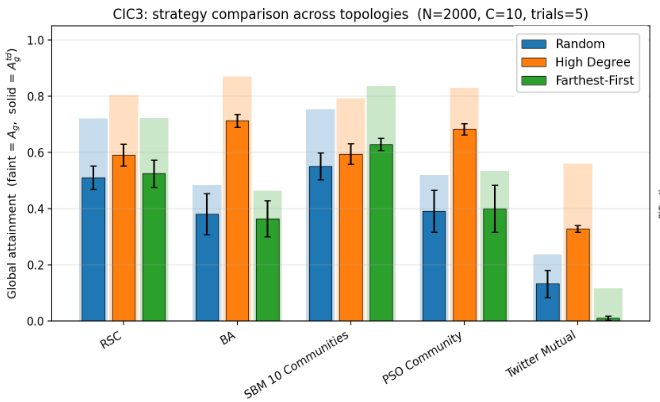

The high degree seeding strategy nearly universally beats other strategies. Except in the topology where there is community structure but no hubs, where the farthest-first strategy works best. It is possible this topology is different from the others because farthest-first takes advantage of community structure but still works worse than high degree in the presence of hubs.

To test this effect, we design an experiment to vary the control of a central hub community (rich club). The idea is to vary how well connected a hub community is to other communities compared to how well they are connected to each other. Let $p_{\text{inter}}$ be the inter-connection block probabilities for the non-hub communities, $p_{\text{CP}}$ be the block connection probability between the core community and the periphery communities, and $p_{\text{intra}}$ be the intra-community block probability. We then sweep $p_{\text{inter}}$ and $p_{\text{CP}}$ from 0 to $p_{\text{intra}}$ and analyze the results across the $p_{\text{CP}}-p_{\text{inter}}$ spectrum. 

When $p_{\text{CP}}>p_{\text{inter}}$, the hub community is a rich club that is well connected in the system. When $p_{\text{inter}}>p_{\text{CP}}$, the central community is a poor club that is worse-connected compared to the rest of the network. The experimental design is explained in more detail in Appendix A.

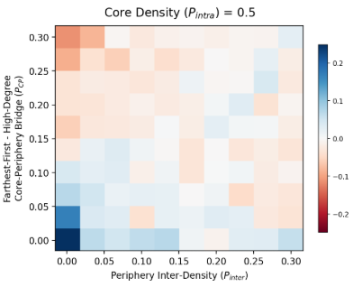

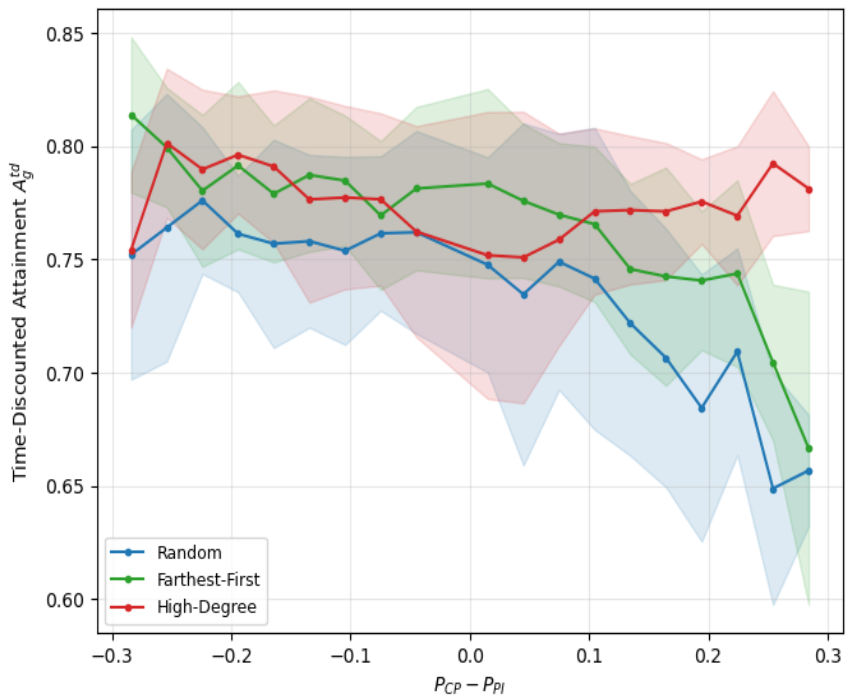

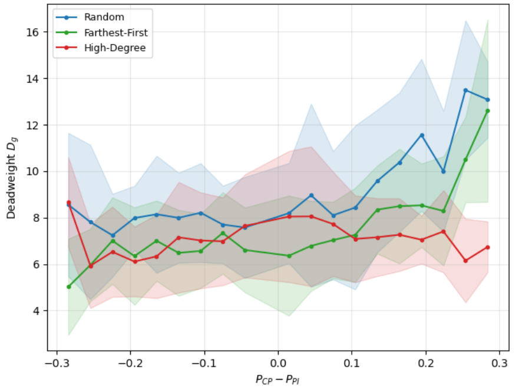

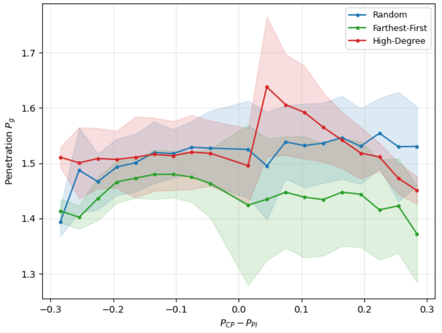

Figure 13a is a heatmap showing the difference in attainment between the farthest-first strategy and the high degree strategy across different values of $p_{\text{inter}}$ (x axis) and $p_{\text{CP}}$ (y axis). It shows that high degree only starts winning substantially at high values of $p_{\text{CP}}$ and low values of $p_{\text{inter}}$ (rich club) while the rest looks like noise. The other networks show more interesting results. The 1-d sweeps show an interesting result at the "rich club" side of the spectrum. High degree works substantially better when there is a well connected rich club because it reduces deadweight. One possible explanation is that, while the other strategies allow for one contagion to reach the rich club first thus providing an unfair advantage to that contagion, the high degree seeding places all contagions in the rich club to start, meaning that each contagion has an equal footing.

## 6. Conclusion

This paper introduced the Competitive Independent Capacity-Constrained Cascade (CIC3) model, extending the Simplicial Contagion Model to capture competitive diffusion scenarios with hard quotas. Through systematic experimentation across synthetic and empirical networks, we identified several key findings that inform the design of seeding strategies in competitive contagion systems.

First, we found that pairwise infectivity ($\lambda$) substantially affects system performance, with higher values leading to increased attainment through reduced deadweight and improved penetration. Surprisingly, higher-order infectivity ($\lambda_{\Delta}$) showed minimal impact on CIC3 outcomes, suggesting that group interactions play a secondary role in competitive scenarios compared to single-contagion settings.

Second, our investigation of network topology revealed that power-law degree distributions negatively impact CIC3 performance due to first-mover advantages at hub nodes. This finding contrasts with single-contagion scenarios where hubs typically facilitate rapid spread. The introduction of randomness through edge rewiring consistently improved system performance across all metrics.

Third, our seeding strategy experiments demonstrated that high-degree seeding generally outperforms community-based approaches, with one notable exception: in networks with strong community structure but no dominant hubs, farthest-first seeding achieved superior results by exploiting community boundaries.

These findings have practical implications for applications such as event promotion, viral marketing, and information dissemination campaigns where multiple messages compete for limited attention. Future work could extend the CIC3 framework to weighted networks, dynamic topologies, and asymmetric contagion scenarios where different processes have varying infectivity rates.

## 7. References

[1] Iacopini, I., Petri, G., Barrat, A., & Latora, V. (2019). Simplicial models of social contagion. *Nature Communications*, 10(1), 2485.

[2] Barabasi, A. L., & Albert, R. (1999). Emergence of scaling in random networks. *Science*, 286(5439), 509-512.

[3] Papadopoulos, F., Kitsak, M., Serrano, M. A., Boguna, M., & Krioukov, D. (2012). Popularity versus similarity in growing networks. *Nature*, 489(7417), 537-540.

[4] Leskovec, J., & Krevl, A. (2014). SNAP Datasets: Stanford Large Network Dataset Collection. https://snap.stanford.edu/data

## Appendix A: Experimental Methodologies

This appendix provides detailed specifications for the experiments discussed in Sections 5.1, 5.2, and 5.3.

### A.1 Community Structure Sweep Experiment

**Objective:** Measure the effect of community structure strength on CIC3 metrics while holding average degree constant.

**Network Configuration:**
- **Model:** Stochastic Block Model (SBM) with $K=25$ communities
- **Size:** $N=2000$ nodes, with 80 nodes per community
- **Triangle probability:** $p_{\text{tri}} = 0.003$ (intra-community only)
- **Topology seed:** 2025 (for reproducibility)

**Constant-Edge-Budget Design:**
To isolate the effect of community structure from density effects, we designed a sweep where total expected edges remain constant as community structure varies. The sweep moves along a curve where:
- At $p_{\text{inter}} = 0$: Communities are isolated full cliques ($p_{\text{intra}} \approx 1$)
- At $p_{\text{inter}} \approx 0.03$: Communities are barely distinguishable ($p_{\text{intra}} \approx 0.08$)

The relationship follows: $p_{\text{intra}} = 1 - 30.7 \cdot p_{\text{inter}}$

**CIC3 Parameters:**
- Number of contagions: $C=10$
- Quotas: Equal quotas of $N/C = 200$ nodes each (sum equals $N$, no slack)
- Seeds per contagion: 1
- Rescaled infectivity: $\lambda = 1.0$, $\lambda_{\Delta} = 2.0$
- Time discount: Exponential decay with rate 0.05
- Maximum simulation time: $T_{\text{max}} = 300$ timesteps

**Simulation Protocol:**
- 15 independent trials per $(p_{\text{inter}}, p_{\text{intra}})$ configuration
- Random seeding strategy (MultiRandomSeeding)
- Metrics recorded: $A_g$, $A_g^{\text{td}}$, $D_g$, $P_g$

**Block Matrix Structure:**

| $p_{\text{intra}}$ | $p_{\text{inter}}$ | $p_{\text{inter}}$ | ... | $p_{\text{inter}}$ |
|---|---|---|---|---|
| $p_{\text{inter}}$ | $p_{\text{intra}}$ | $p_{\text{inter}}$ | ... | $p_{\text{inter}}$ |
| $p_{\text{inter}}$ | $p_{\text{inter}}$ | $p_{\text{intra}}$ | ... | $p_{\text{inter}}$ |
| ... | ... | ... | ... | ... |
| $p_{\text{inter}}$ | $p_{\text{inter}}$ | $p_{\text{inter}}$ | ... | $p_{\text{intra}}$ |

### A.2 Hub Rewiring Experiment

**Objective:** Measure the effect of degree distribution on CIC3 metrics by progressively randomizing a power-law network.

**Network Configuration:**
- **Base model:** Barabasi-Albert (BA) preferential attachment
- **Size:** $N=2000$ nodes
- **BA parameters:** $m=5$ (edges per new node), $m_{\Delta}=2$ (triangles per new node)
- **Rewiring:** Progressive edge rewiring from 0% (pure BA) to 100% (random graph)

**Rewiring Procedure:**
1. Generate base BA network with topology seed 2025
2. For each rewiring fraction $p_{\text{rp}} \in [0, 0.05, 0.10, ..., 1.0]$:
   - Sample $p_{\text{rp}} \times |E|$ edges uniformly at random
   - Remove sampled edges
   - Add same number of edges between random node pairs
   - This preserves total edge count while reducing power-law characteristics

**CIC3 Parameters:**
- Number of contagions: $C=10$
- Quotas: Equal quotas summing to $N$ (no slack)
- Seeds per contagion: 1 per contagion
- Rescaled infectivity: Three values tested ($\lambda \in \{0.7, 1.0, 1.3\}$), $\lambda_{\Delta} = 2.0$
- Time discount: Exponential decay with rate 0.01
- Maximum simulation time: $T_{\text{max}} = 1000$ timesteps

**Simulation Protocol:**
- 15 independent trials per $(p_{\text{rp}}, \lambda)$ configuration
- Random seeding strategy
- Metrics recorded: $A_g$, $A_g^{\text{td}}$, $D_g$, $P_g$

### A.3 Seeding Strategy Comparison Experiment

**Objective:** Compare seeding strategies across topologies with varying combinations of community structure and hub prevalence.

**Topologies Tested:**
1. **RSC (Random Simplicial Complex):** Neither community structure nor hubs
   - $k_{\text{avg}} = 20$, $k_{\Delta,\text{avg}} = 6$
   
2. **PA (Preferential Attachment):** Hubs but no community structure
   - $m=5$, $m_{\Delta}=2$
   
3. **SBM 10 Communities Without Hubs:** Community structure but no hubs
   - $K=10$ equal communities
   - Intra-community fraction: 0.8
   
4. **SBM 10 Communities With Hubs:** Both community structure and hubs
   - 52 small communities (size 9) + 1 hub community (size 32)
   - Hub has high connectivity to all other communities
   
5. **PSO Community:** Power-law degree distribution with community structure
   - Popularity-Similarity Optimization with Gaussian-mixture angular prior
   - $\gamma \approx 3$ (power-law exponent), 50 communities
   
6. **Twitter Collapsed/Mutual:** Empirical networks from Twitter data
   - ~81,000 nodes, mutual-follows edge definition

**Seeding Strategies:**
1. **Random:** Uniform random selection of seed nodes
2. **High Degree:** Select highest-degree nodes (round-robin across contagions)
3. **High 2-Simplex:** Select nodes with most triangle participations
4. **Louvain:** Community-based seeding using modularity optimization
5. **Farthest-First:** Maximize separation between seed sets via BFS

**CIC3 Parameters:**
- Number of contagions: $C=10$ (synthetic), varies for Twitter
- Quotas: Equal quotas summing to $N$ (no slack)
- Infection rates: $\beta = 0.04$, $\beta_{\Delta} = 0.03$
- Time discount: Exponential decay with rate 0.25
- Maximum simulation time: $T_{\text{max}} = 200$ timesteps

**Simulation Protocol:**
- 5 independent trials per (topology, strategy) pair
- Metrics recorded: $A_g$, $A_g^{\text{td}}$, per-contagion $A_i^{\text{td}}$ distributions

### A.4 Lambda and Lambda Delta Sweep Experiment

**Objective:** Characterize how pairwise and higher-order infectivity affect attainment, deadweight, and penetration.

**Network Configuration:**
- **Topologies:** RSC, BA, SBM (10 equal communities)
- **Size:** $N=2000$ nodes
- **Target statistics:** $k_{\text{avg}} \approx 20$, $k_{\Delta,\text{avg}} \approx 6$
- **Topology seed:** 2025

**Sweep Design:**
1. **Lambda sweep:** $\lambda \in [0.05, 3.0]$ (30 points), fixed $\lambda_{\Delta} \in \{0.5, 1.0, 3.0\}$
2. **Lambda-delta sweep:** $\lambda_{\Delta} \in [0.05, 5.0]$ (30 points), fixed $\lambda \in \{0.5, 1.0, 2.0\}$

**CIC3 Parameters:**
- Number of contagions: $C=10$
- Quotas: Equal quotas of 200 nodes each (sum equals $N$)
- Seeds per contagion: 1
- Time discount: Exponential decay with rate 0.05
- Maximum simulation time: $T_{\text{max}} = 1000$ timesteps

**Simulation Protocol:**
- 15 independent trials per $(\lambda, \lambda_{\Delta}, \text{topology})$ configuration
- Random seeding strategy
- Metrics recorded: $A_g$, $A_g^{\text{td}}$, $D_g$, $P_g$

### A.5 Rich Club (Core-Periphery) Experiment

**Objective:** Test the interaction between seeding strategies and rich club structure.

**Network Configuration:**
- **Model:** SBM with core-periphery structure
- **Size:** $N=2000$ nodes
- **Structure:** 1 core community (50 nodes) + 9 periphery communities (216 nodes each)
- **Block probability matrix:**
  - $p_{\text{CC}}$ (core-core): 0.8
  - $p_{\text{CP}}$ (core-periphery): variable
  - $p_{\text{PI}}$ (periphery-periphery inter): variable
  - $p_{\text{intra}}$ (periphery intra): 0.1

**Sweep Design:**
- Grid resolution: $19 \times 19$
- $p_{\text{CP}} \in [0.001, 0.1]$ (y-axis)
- $p_{\text{PI}} \in [0.001, 0.1]$ (x-axis)
- Fixed $p_{\text{CC}} = 0.1$

**Seeding Strategies:**
- Random, Farthest-First, High-Degree

**CIC3 Parameters:**
- Number of contagions: $C=10$
- Infection rates: $\beta = 0.05$, $\beta_{\Delta} = 0.1$
- Time discount: Exponential decay with rate 0.05
- Maximum simulation time: $T_{\text{max}} = 2000$ timesteps

**Simulation Protocol:**
- 15 independent trials per grid point
- Metrics recorded: $A_g^{\text{td}}$, $D_g$, $P_g$
- Analysis: Strategy differences computed as $\Delta A_g^{\text{td}} = A_g^{\text{td}}(\text{strategy}_1) - A_g^{\text{td}}(\text{strategy}_2)$

**Block Matrix Structure:**

| $p_{\text{intra}}$ | $p_{\text{CP}}$ | $p_{\text{CP}}$ | ... | $p_{\text{CP}}$ |
|---|---|---|---|---|
| $p_{\text{CP}}$ | $p_{\text{intra}}$ | $p_{\text{PI}}$ | ... | $p_{\text{PI}}$ |
| $p_{\text{CP}}$ | $p_{\text{PI}}$ | $p_{\text{intra}}$ | ... | $p_{\text{PI}}$ |
| ... | ... | ... | ... | ... |
| $p_{\text{CP}}$ | $p_{\text{PI}}$ | $p_{\text{PI}}$ | ... | $p_{\text{intra}}$ |

### A.6 Common Implementation Details

**Simplicial Complex Generation:**
All synthetic networks are generated using the `scm` Python package implementing:
- RSC: Binomial sampling of edges and triangles
- BA: Preferential attachment with simplicial extension
- SBM: Block-structured edge and triangle sampling

**CIC3 Simulation:**
- Synchronous update SI dynamics (no recovery)
- Exclusive infection states (nodes can host at most one contagion)
- Triangle reinforcement requires both other members infected by same contagion
- Tie-breaking: Uniform random among successful infections

**Metric Computation:**
- Attainment: Capped at quota, normalized by quota
- Time discount: Applied to sorted infection times, $V(t) = e^{-\text{rate} \cdot t}$
- Deadweight: Excess infections beyond quota
- Penetration: Mean BFS distance from seeds to all infected nodes

**Statistical Aggregation:**
- All reported means and standard deviations computed across independent trials
- Error bars in figures represent $\pm 1$ standard deviation
